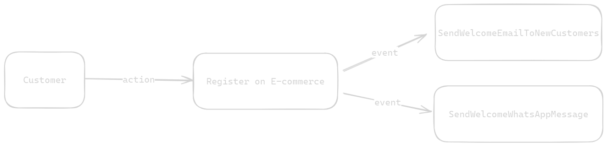

# Understanding Domain Events

> I recommend reading about Domain Driven Design before diving into this content to better understand what I'm addressing. I'll leave the link for understanding the subject.

Check in [portuguese](.github/docs/pt-br.md) if you prefer.

### What on earth is this?
Briefly, domain events are consequences of an action that occurred in the past within a domain.

### Okay, I don't get it...
A very simple example is: A customer just registered on an e-commerce website, so as a consequence of this action (the act of registering), they will receive a welcome email.
The "receive a welcome email" is an event that we can call SendWelcomeEmailToNewCustomers originating from the Customer domain.

### Can you draw it?
Of course, take a look at the visual representation of the example above:



Notice that I demonstrated another event, SendWelcomeWhatsAppMessage, which can also be a consequence of registering on the e-commerce website.

### Okay, what now?
I will demonstrate the practical implementation of this example I just showed. Pay attention to the DomainEvents class as it will be responsible for generating the firing and "listening" of existing events.

### Running the code...
To do so, simply type this command in your terminal:
```bash
npm run test
```