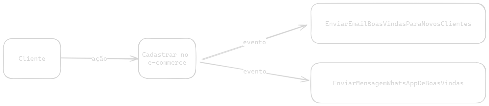

# Entendendo Eventos de Domínio (Domain Events)

## Disclaimer
> Recomendo antes de estar lendo sobre esse conteúdo de Domain Driven Design, para compreender melhor do que estou abordando.
> Deixarei o [link](https://www.youtube.com/watch?v=vFZkOyaPK4E) para compreensão sobre o assunto.

### O que raios é isso?
De uma forma bem breve, eventos de domínio são consequências de uma ação que aconteceu no passado dentro de um domínio.

### Tá, não entendi...
Um exemplo bem simples que posso citar é: Um cliente acabou de se cadastrar em um e-commerce, logo como consequência dessa ação (o ato de se cadastrar), irá receber um e-mail de boas-vindas.
O "receber um e-mail de boas-vindas" é um evento que podemos chamar de ***EnviarEmailBoasVindasParaNovosClientes*** que partiu do domínio de ***Cliente***.

### E se desenhar?
Mas claro que posso, veja na imagem a representação visual do exemplo acima:



Perceba que eu demonstrei mais um evento, o ***EnviarMensagemWhatsAppDeBoasVindas*** que também pode ser uma consequência da ação de se fazer um cadastro.

Irei demonstrar na prática a implementação desse exemplo que acabei de demonstrar, sugiro que se atente na classe de **DomainEvents** pois a mesma será a responsável por gerar o disparo e "escuta" dos eventos existentes.

### Rodando o código...
Para tal basta digitar este comando no seu terminal:
```bash
npm run test
```